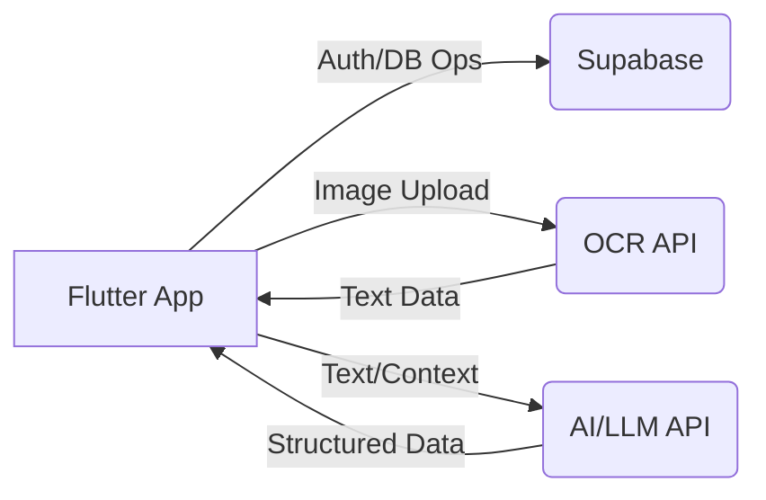
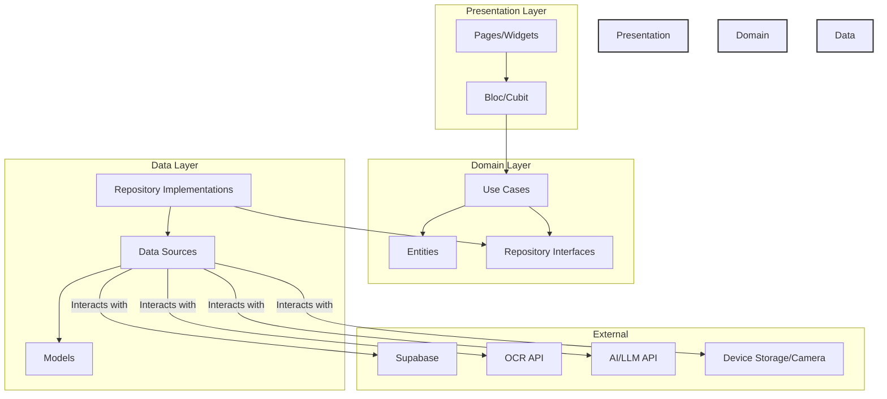

# ⚙️ System Design: Hyper Split Bill

## 1. 📝 Introduction

This document outlines the system design for the Hyper Split Bill application. The goal is to provide a comprehensive overview of the architecture, components, data flow, and external integrations used to deliver the bill splitting functionality.

## 2. 🎯 Goals

*   Provide a user-friendly interface for uploading and managing shared bills.
*   Automate the extraction of bill details (items, prices) from images using OCR.
*   Intelligently structure extracted data using AI/LLM capabilities.
*   Allow users to easily review, edit, and correct extracted/structured data.
*   Enable assignment of bill items to multiple participants.
*   Accurately calculate the amount owed by each participant.
*   Securely authenticate users and store their bill data.
*   Support multiple platforms (Web, iOS, Android) via Flutter.

## 3. ❌ Non-Goals

*   Real-time payment processing or integration with payment gateways.
*   Complex budgeting or financial analysis features beyond bill splitting.
*   Social features like friend requests or group management beyond a single bill context.
*   Offline-first functionality (assumes network connectivity for core features like OCR, AI, and Supabase interaction).

## 4. 🏗️ Architecture

### 4.1. High-Level Overview

The system follows a client-server architecture where the Flutter application (client) interacts with backend services (Supabase) and external APIs (OCR, AI).

**Flow:**

1.  User uploads a bill image.
2.  App sends the image to an external OCR API.
3.  OCR API returns extracted text.
4.  App potentially sends extracted text (and maybe image context) to an AI/LLM API for structuring.
5.  AI API returns structured data (items, prices).
6.  User reviews/edits the data in the app.
7.  User saves the final bill details to Supabase DB via the app.

### 4.2. Detailed Architecture: Clean Architecture + Bloc

The Flutter application employs Clean Architecture layered with Bloc for state management.

*   **Presentation Layer:** Handles UI rendering (`Pages`, `Widgets`) and state management (`Bloc`). User interactions trigger events in Blocs. Blocs call Domain layer Use Cases and emit states to update the UI. Uses `go_router` for navigation.
*   **Domain Layer:** Contains the core business logic. `Use Cases` orchestrate data flow by interacting with `Repository Interfaces`. `Entities` represent core business objects. This layer is independent of Flutter and external frameworks.
*   **Data Layer:** Implements the `Repository Interfaces` defined in the Domain layer. `Repositories` fetch data from appropriate `Data Sources` (e.g., `AuthRemoteDataSource`, `BillRemoteDataSource`, `OcrDataSource`, `ChatDataSource`). `Data Sources` interact directly with external services (Supabase, APIs) or local storage. `Models` represent data structures specific to the data sources (e.g., JSON parsing).

### 4.3. Component Breakdown

*   **Core:** Foundational elements like routing (`go_router`), dependency injection (`get_it`, `injectable`), theme, constants, error handling.
*   **Features:** Self-contained modules:
    *   **Auth:** Handles user sign-up, login, session management using `AuthBloc`, `AuthRepository`, `AuthRemoteDataSource` (interacting with Supabase Auth).
    *   **Bill Splitting:** The core feature encompassing:
        *   `BillUploadPage`: Handles image selection/cropping.
        *   `ImageCropPage`: Handles image cropping UI.
        *   `BillEditPage`: Displays structured data, allows editing items, participants, currency, etc. Uses various widgets (`BillItemsSection`, `BillParticipantsSection`).
        *   `ChatbotPage`: (Potential) Interface for interacting with the AI structuring service.
        *   `BillSplittingBloc`: Manages the state for the entire bill processing flow (uploading, OCR, structuring, editing, saving).
        *   `ProcessBillOcrUseCase`, `CreateBillUseCase`, `GetBillsUseCase`, `SendChatMessageUseCase`: Domain logic for specific actions.
        *   `BillRepository`: Interface for bill-related data operations.
        *   `BillRepositoryImpl`: Implementation coordinating `BillRemoteDataSource`, `OcrDataSource`, `ChatDataSource`.
        *   `OcrDataSource`: Interface/Implementation for interacting with the OCR API.
        *   `ChatDataSource`: Interface/Implementation for interacting with the AI/LLM API.
        *   `BillRemoteDataSource`: Interface/Implementation for interacting with Supabase DB (CRUD operations for bills).

## 5. ➡️ Data Flow Example: Uploading and Processing a Bill

1.  **User Action:** User taps "Upload from Gallery" on `BillUploadPage`.
2.  **Presentation:**
    *   `_pickImageFromGallery` is called. `image_picker` selects an image (`XFile`).
    *   User crops image via `ImageCropPage` (using `image_cropper` likely).
    *   User confirms upload. `BillUploadPage` triggers `ProcessBill` event in `BillSplittingBloc`, passing the cropped image file/bytes.
3.  **Bloc:**
    *   `BillSplittingBloc` receives `ProcessBill` event.
    *   Emits `BillSplittingOcrProcessing` state (UI shows loading indicator).
    *   Calls `ProcessBillOcrUseCase`.
4.  **Domain:**
    *   `ProcessBillOcrUseCase` calls `processBillImage` on the `BillRepository` interface.
5.  **Data:**
    *   `BillRepositoryImpl.processBillImage` calls `processImage` on `OcrDataSource`.
    *   `OcrDataSourceImpl` sends the image data to the external OCR API.
    *   OCR API returns extracted text.
    *   (Optional AI Structuring Flow):
        *   `BillRepositoryImpl` might then call `structureData` on `ChatDataSource` (passing OCR text).
        *   `ChatDataSourceImpl` sends text to AI/LLM API.
        *   AI API returns structured `BillEntity` data.
    *   `BillRepositoryImpl` returns the structured `BillEntity` (or raw OCR text if no AI step).
6.  **Domain:** `ProcessBillOcrUseCase` receives the result from the repository.
7.  **Bloc:**
    *   `BillSplittingBloc` receives the structured `BillEntity` (or text).
    *   Emits `BillSplittingSuccess` (or `BillSplittingNeedsStructuring` if only text was returned) state with the data.
    *   Navigates user to `BillEditPage` via `go_router`, passing the processed data.
8.  **Presentation:** `BillEditPage` builds its UI based on the state received from the `BillSplittingBloc`, displaying the structured items and participants.

## 6. 🌐 External Services

*   **Supabase:** Used for authentication (Supabase Auth) and database storage (Supabase Postgres) for user data and bills. Accessed via `supabase_flutter` package.
*   **OCR API:** An external service responsible for converting bill images to text. Requires API key management. (Specific service TBD).
*   **AI/LLM API:** An external service (like OpenAI, Gemini, etc.) potentially used via a chat-like interface (`ChatDataSource`) to structure the raw OCR text into meaningful bill items and participants. Requires API key management. (Specific service TBD).

## 7. 💾 Database Schema (Conceptual - Supabase)

*   **users:** (Managed by Supabase Auth) Stores user profile information.
*   **bills:**
    *   `id` (uuid, PK)
    *   `user_id` (uuid, FK to auth.users)
    *   `title` (text)
    *   `bill_date` (date/timestamp)
    *   `currency` (text)
    *   `total_amount` (numeric) - Calculated or stored
    *   `created_at` (timestamp)
    *   `image_url` (text, optional - storage link)
*   **participants:**
    *   `id` (uuid, PK)
    *   `bill_id` (uuid, FK to bills)
    *   `name` (text)
    *   `user_id` (uuid, FK to auth.users, optional - if linked to app users)
*   **bill_items:**
    *   `id` (uuid, PK)
    *   `bill_id` (uuid, FK to bills)
    *   `description` (text)
    *   `quantity` (integer, default 1)
    *   `price` (numeric)
*   **item_assignments:** (Many-to-Many linking items to participants)
    *   `item_id` (uuid, FK to bill_items)
    *   `participant_id` (uuid, FK to participants)
    *   `share_amount` (numeric) - Calculated portion for this participant

*(Note: This is a conceptual schema. The actual implementation might differ.)*

## 8. 📜 API Contracts (Conceptual)

*   **OCR API Request:** `POST /ocr` with `image_data` (base64 or multipart/form-data).
*   **OCR API Response:** `{ "text": "extracted text..." }`
*   **AI/LLM API Request:** `POST /structure_bill` with `{ "ocr_text": "...", "context": "..." }`
*   **AI/LLM API Response:** `{ "bill": { "title": "...", "items": [...], "participants": [...] } }`

## 9. ⚡ Scalability & Performance

*   Flutter's rendering engine is generally performant.
*   State management with Bloc is scalable for complex UIs.
*   External API calls (OCR, AI) are potential bottlenecks; handled asynchronously with loading indicators.
*   Supabase provides scalable backend infrastructure. Database queries should be optimized.
*   Image processing (upload, potential resizing) should be done efficiently.

## 10. 🔒 Security Considerations

*   Secure handling of Supabase credentials and API keys (using `.env` and potentially secure storage).
*   Authentication managed by Supabase Auth.
*   Input validation on user-editable fields.
*   Row Level Security (RLS) in Supabase is crucial to ensure users can only access their own bills.
*   HTTPS used for all external API communication.