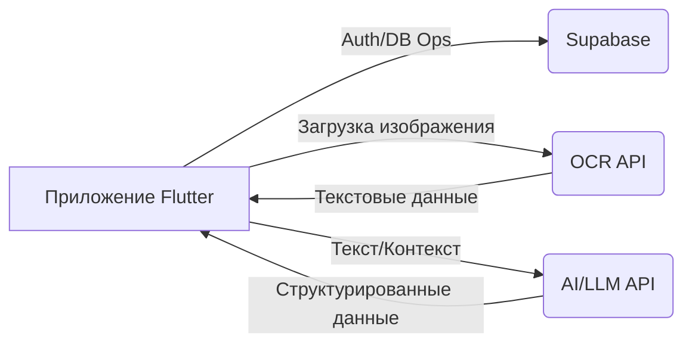
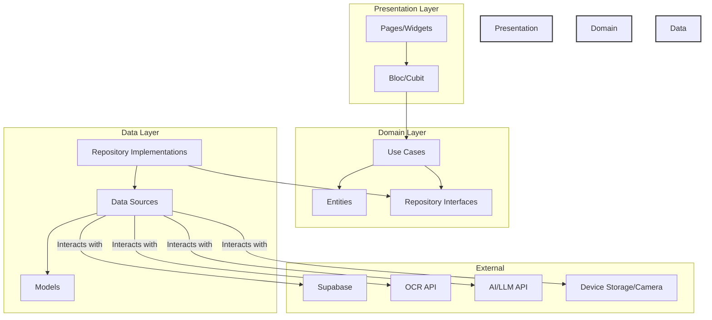

# ⚙️ Дизайн Системы: Hyper Split Bill

## 1. 📝 Введение

Этот документ описывает дизайн системы для приложения Hyper Split Bill. Цель состоит в том, чтобы предоставить всесторонний обзор архитектуры, компонентов, потока данных и внешних интеграций, используемых для реализации функциональности разделения счетов.

## 2. 🎯 Цели

*   Предоставить удобный интерфейс для загрузки и управления общими счетами.
*   Автоматизировать извлечение деталей счета (позиции, цены) из изображений с помощью OCR.
*   Интеллектуально структурировать извлеченные данные с использованием возможностей ИИ/LLM.
*   Позволить пользователям легко просматривать, редактировать и исправлять извлеченные/структурированные данные.
*   Обеспечить возможность назначения позиций счета нескольким участникам.
*   Точно рассчитывать сумму, которую должен каждый участник.
*   Безопасно аутентифицировать пользователей и хранить данные их счетов.
*   Поддерживать несколько платформ (Web, iOS, Android) с помощью Flutter.

## 3. ❌ Не-цели

*   Обработка платежей в реальном времени или интеграция с платежными шлюзами.
*   Сложные функции бюджетирования или финансового анализа, выходящие за рамки разделения счетов.
*   Социальные функции, такие как запросы в друзья или управление группами вне контекста одного счета.
*   Функциональность Offline-first (предполагается наличие сетевого подключения для основных функций, таких как OCR, ИИ и взаимодействие с Supabase).

## 4. 🏗️ Архитектура

### 4.1. Высокоуровневый обзор

Система следует клиент-серверной архитектуре, где приложение Flutter (клиент) взаимодействует с бэкенд-сервисами (Supabase) и внешними API (OCR, ИИ).

**Поток:**

1.  Пользователь загружает изображение счета.
2.  Приложение отправляет изображение во внешний OCR API.
3.  OCR API возвращает извлеченный текст.
4.  Приложение потенциально отправляет извлеченный текст (и, возможно, контекст изображения) в AI/LLM API для структурирования.
5.  AI API возвращает структурированные данные (позиции, цены).
6.  Пользователь просматривает/редактирует данные в приложении.
7.  Пользователь сохраняет окончательные детали счета в базу данных Supabase через приложение.

### 4.2. Детальная архитектура: Clean Architecture + Bloc

Приложение Flutter использует Clean Architecture в сочетании с Bloc для управления состоянием.

*   **Presentation Layer:** Отвечает за рендеринг UI (`Страницы`, `Виджеты`) и управление состоянием (`Bloc`). Взаимодействия пользователя вызывают события в Blocs. Blocs вызывают Use Cases доменного слоя и генерируют состояния для обновления UI. Использует `go_router` для навигации.
*   **Domain Layer:** Содержит основную бизнес-логику. `Use Cases` управляют потоком данных, взаимодействуя с `Интерфейсами Репозиториев`. `Сущности` представляют основные бизнес-объекты. Этот слой не зависит от Flutter и внешних фреймворков.
*   **Data Layer:** Реализует `Интерфейсы Репозиториев`, определенные в доменном слое. `Репозитории` извлекают данные из соответствующих `Источников Данных` (например, `AuthRemoteDataSource`, `BillRemoteDataSource`, `OcrDataSource`, `ChatDataSource`). `Источники Данных` напрямую взаимодействуют с внешними сервисами (Supabase, API) или локальным хранилищем. `Модели` представляют структуры данных, специфичные для источников данных (например, для парсинга JSON).

### 4.3. Разбивка компонентов

*   **Core:** Базовые элементы, такие как маршрутизация (`go_router`), внедрение зависимостей (`get_it`, `injectable`), тема, константы, обработка ошибок.
*   **Features:** Автономные модули:
    *   **Auth:** Обрабатывает регистрацию, вход, управление сессиями пользователя с использованием `AuthBloc`, `AuthRepository`, `AuthRemoteDataSource` (взаимодействуя с Supabase Auth).
    *   **Bill Splitting:** Основная функция, включающая:
        *   `BillUploadPage`: Обрабатывает выбор/обрезку изображения.
        *   `ImageCropPage`: Обрабатывает UI обрезки изображения.
        *   `BillEditPage`: Отображает структурированные данные, позволяет редактировать позиции, участников, валюту и т.д. Использует различные виджеты (`BillItemsSection`, `BillParticipantsSection`).
        *   `ChatbotPage`: (Возможно) Интерфейс для взаимодействия с сервисом структурирования ИИ.
        *   `BillSplittingBloc`: Управляет состоянием всего процесса обработки счета (загрузка, OCR, структурирование, редактирование, сохранение).
        *   `ProcessBillOcrUseCase`, `CreateBillUseCase`, `GetBillsUseCase`, `SendChatMessageUseCase`: Доменная логика для конкретных действий.
        *   `BillRepository`: Интерфейс для операций с данными, связанными со счетами.
        *   `BillRepositoryImpl`: Реализация, координирующая `BillRemoteDataSource`, `OcrDataSource`, `ChatDataSource`.
        *   `OcrDataSource`: Интерфейс/Реализация для взаимодействия с OCR API.
        *   `ChatDataSource`: Интерфейс/Реализация для взаимодействия с AI/LLM API.
        *   `BillRemoteDataSource`: Интерфейс/Реализация для взаимодействия с базой данных Supabase (CRUD операции для счетов).

## 5. ➡️ Пример потока данных: Загрузка и обработка счета

1.  **Действие пользователя:** Пользователь нажимает "Загрузить из галереи" на `BillUploadPage`.
2.  **Представление:**
    *   Вызывается `_pickImageFromGallery`. `image_picker` выбирает изображение (`XFile`).
    *   Пользователь обрезает изображение через `ImageCropPage` (вероятно, используя `image_cropper`).
    *   Пользователь подтверждает загрузку. `BillUploadPage` инициирует событие `ProcessBill` в `BillSplittingBloc`, передавая обрезанный файл/байты изображения.
3.  **Bloc:**
    *   `BillSplittingBloc` получает событие `ProcessBill`.
    *   Генерирует состояние `BillSplittingOcrProcessing` (UI показывает индикатор загрузки).
    *   Вызывает `ProcessBillOcrUseCase`.
4.  **Домен:**
    *   `ProcessBillOcrUseCase` вызывает `processBillImage` в интерфейсе `BillRepository`.
5.  **Данные:**
    *   `BillRepositoryImpl.processBillImage` вызывает `processImage` в `OcrDataSource`.
    *   `OcrDataSourceImpl` отправляет данные изображения во внешний OCR API.
    *   OCR API возвращает извлеченный текст.
    *   (Опциональный поток структурирования ИИ):
        *   `BillRepositoryImpl` может затем вызвать `structureData` в `ChatDataSource` (передавая текст OCR).
        *   `ChatDataSourceImpl` отправляет текст в AI/LLM API.
        *   AI API возвращает структурированные данные `BillEntity`.
    *   `BillRepositoryImpl` возвращает структурированный `BillEntity` (или необработанный текст OCR, если шаг ИИ отсутствует).
6.  **Домен:** `ProcessBillOcrUseCase` получает результат из репозитория.
7.  **Bloc:**
    *   `BillSplittingBloc` получает структурированный `BillEntity` (или текст).
    *   Генерирует состояние `BillSplittingSuccess` (или `BillSplittingNeedsStructuring`, если был возвращен только текст) с данными.
    *   Перенаправляет пользователя на `BillEditPage` через `go_router`, передавая обработанные данные.
8.  **Представление:** `BillEditPage` строит свой UI на основе состояния, полученного от `BillSplittingBloc`, отображая структурированные позиции и участников.

## 6. 🌐 Внешние сервисы

*   **Supabase:** Используется для аутентификации (Supabase Auth) и хранения данных в базе данных (Supabase Postgres) для пользовательских данных и счетов. Доступ осуществляется через пакет `supabase_flutter`.
*   **OCR API:** Внешний сервис, отвечающий за преобразование изображений счетов в текст. Требует управления ключами API. (Конкретный сервис TBD).
*   **AI/LLM API:** Внешний сервис (например, OpenAI, Gemini и т.д.), потенциально используемый через интерфейс, подобный чату (`ChatDataSource`), для структурирования необработанного текста OCR в осмысленные позиции счета и участников. Требует управления ключами API. (Конкретный сервис TBD).

## 7. 💾 Схема базы данных (Концептуальная - Supabase)

*   **users:** (Управляется Supabase Auth) Хранит информацию профиля пользователя.
*   **bills:**
    *   `id` (uuid, PK)
    *   `user_id` (uuid, FK к auth.users)
    *   `title` (text)
    *   `bill_date` (date/timestamp)
    *   `currency` (text)
    *   `total_amount` (numeric) - Рассчитанная или сохраненная
    *   `created_at` (timestamp)
    *   `image_url` (text, опционально - ссылка на хранилище)
*   **participants:**
    *   `id` (uuid, PK)
    *   `bill_id` (uuid, FK к bills)
    *   `name` (text)
    *   `user_id` (uuid, FK к auth.users, опционально - если связано с пользователями приложения)
*   **bill_items:**
    *   `id` (uuid, PK)
    *   `bill_id` (uuid, FK к bills)
    *   `description` (text)
    *   `quantity` (integer, по умолчанию 1)
    *   `price` (numeric)
*   **item_assignments:** (Связь многие-ко-многим между позициями и участниками)
    *   `item_id` (uuid, FK к bill_items)
    *   `participant_id` (uuid, FK к participants)
    *   `share_amount` (numeric) - Рассчитанная доля для этого участника

*(Примечание: Это концептуальная схема. Фактическая реализация может отличаться.)*

## 8. 📜 Контракты API (Концептуальные)

*   **Запрос OCR API:** `POST /ocr` с `image_data` (base64 или multipart/form-data).
*   **Ответ OCR API:** `{ "text": "извлеченный текст..." }`
*   **Запрос AI/LLM API:** `POST /structure_bill` с `{ "ocr_text": "...", "context": "..." }`
*   **Ответ AI/LLM API:** `{ "bill": { "title": "...", "items": [...], "participants": [...] } }`

## 9. ⚡ Масштабируемость и производительность

*   Движок рендеринга Flutter в целом производителен.
*   Управление состоянием с помощью Bloc масштабируемо для сложных UI.
*   Вызовы внешних API (OCR, ИИ) являются потенциальными узкими местами; обрабатываются асинхронно с индикаторами загрузки.
*   Supabase предоставляет масштабируемую бэкенд-инфраструктуру. Запросы к базе данных должны быть оптимизированы.
*   Обработка изображений (загрузка, возможное изменение размера) должна выполняться эффективно.

## 10. 🔒 Соображения безопасности

*   Безопасная обработка учетных данных Supabase и ключей API (с использованием `.env` и, возможно, безопасного хранилища).
*   Аутентификация управляется Supabase Auth.
*   Проверка вводимых данных в редактируемых пользователем полях.
*   Безопасность на уровне строк (RLS) в Supabase имеет решающее значение для обеспечения доступа пользователей только к своим счетам.
*   HTTPS используется для всех внешних коммуникаций API.