# ⚙️ Thiết kế Hệ thống: Hyper Split Bill

## 1. 📝 Giới thiệu

Tài liệu này phác thảo thiết kế hệ thống cho ứng dụng Hyper Split Bill. Mục tiêu là cung cấp một cái nhìn tổng quan toàn diện về kiến trúc, các thành phần, luồng dữ liệu và các tích hợp bên ngoài được sử dụng để cung cấp chức năng chia sẻ hóa đơn.

## 2. 🎯 Mục tiêu

*   Cung cấp giao diện thân thiện với người dùng để tải lên và quản lý các hóa đơn chung.
*   Tự động hóa việc trích xuất chi tiết hóa đơn (các mục, giá cả) từ hình ảnh bằng OCR.
*   Cấu trúc hóa dữ liệu được trích xuất một cách thông minh bằng khả năng của AI/LLM.
*   Cho phép người dùng dễ dàng xem xét, chỉnh sửa và sửa chữa dữ liệu được trích xuất/cấu trúc.
*   Cho phép gán các mục hóa đơn cho nhiều người tham gia.
*   Tính toán chính xác số tiền mà mỗi người tham gia nợ.
*   Xác thực người dùng một cách an toàn và lưu trữ dữ liệu hóa đơn của họ.
*   Hỗ trợ nhiều nền tảng (Web, iOS, Android) thông qua Flutter.

## 3. ❌ Mục tiêu không bao gồm

*   Xử lý thanh toán thời gian thực hoặc tích hợp với các cổng thanh toán.
*   Các tính năng phân tích tài chính hoặc lập ngân sách phức tạp ngoài việc chia sẻ hóa đơn.
*   Các tính năng xã hội như yêu cầu kết bạn hoặc quản lý nhóm ngoài bối cảnh một hóa đơn duy nhất.
*   Chức năng ưu tiên ngoại tuyến (giả định cần kết nối mạng cho các tính năng cốt lõi như OCR, AI và tương tác Supabase).

## 4. 🏗️ Kiến trúc

### 4.1. Tổng quan cấp cao

Hệ thống tuân theo kiến trúc client-server trong đó ứng dụng Flutter (client) tương tác với các dịch vụ backend (Supabase) và các API bên ngoài (OCR, AI).

```mermaid
graph LR
    A[Ứng dụng Flutter] -- Auth/DB Ops --> B(Supabase);
    A -- Tải ảnh lên --> C(OCR API);
    C -- Dữ liệu văn bản --> A;
    A -- Văn bản/Ngữ cảnh --> D(AI/LLM API);
    D -- Dữ liệu có cấu trúc --> A;
```

**Luồng hoạt động:**

1.  Người dùng tải lên hình ảnh hóa đơn.
2.  Ứng dụng gửi hình ảnh đến API OCR bên ngoài.
3.  API OCR trả về văn bản được trích xuất.
4.  Ứng dụng có thể gửi văn bản được trích xuất (và có thể cả ngữ cảnh hình ảnh) đến API AI/LLM để cấu trúc hóa.
5.  API AI trả về dữ liệu có cấu trúc (các mục, giá cả).
6.  Người dùng xem xét/chỉnh sửa dữ liệu trong ứng dụng.
7.  Người dùng lưu chi tiết hóa đơn cuối cùng vào Supabase DB thông qua ứng dụng.

### 4.2. Kiến trúc chi tiết: Clean Architecture + Bloc

Ứng dụng Flutter sử dụng Clean Architecture kết hợp với Bloc để quản lý trạng thái.

*   **Presentation Layer:** Xử lý việc hiển thị UI (`Trang`, `Widgets`) và quản lý trạng thái (`Bloc`). Tương tác của người dùng kích hoạt các sự kiện trong Blocs. Blocs gọi các Use Cases của lớp Domain và phát ra các trạng thái để cập nhật UI. Sử dụng `go_router` để điều hướng.
*   **Domain Layer:** Chứa logic nghiệp vụ cốt lõi. `Use Cases` điều phối luồng dữ liệu bằng cách tương tác với `Giao diện Repository`. `Thực thể` đại diện cho các đối tượng nghiệp vụ cốt lõi. Lớp này độc lập với Flutter và các framework bên ngoài.
*   **Data Layer:** Triển khai các `Giao diện Repository` được định nghĩa trong lớp Domain. `Repositories` tìm nạp dữ liệu từ các `Nguồn dữ liệu` thích hợp (ví dụ: `AuthRemoteDataSource`, `BillRemoteDataSource`, `OcrDataSource`, `ChatDataSource`). `Nguồn dữ liệu` tương tác trực tiếp với các dịch vụ bên ngoài (Supabase, API) hoặc bộ nhớ cục bộ. `Mô hình` đại diện cho các cấu trúc dữ liệu cụ thể cho các nguồn dữ liệu (ví dụ: phân tích cú pháp JSON).

### 4.3. Phân tích thành phần

*   **Core:** Các yếu tố nền tảng như định tuyến (`go_router`), tiêm phụ thuộc (`get_it`, `injectable`), chủ đề, hằng số, xử lý lỗi.
*   **Features:** Các module độc lập:
    *   **Auth:** Xử lý đăng ký, đăng nhập, quản lý phiên người dùng bằng `AuthBloc`, `AuthRepository`, `AuthRemoteDataSource` (tương tác với Supabase Auth).
    *   **Bill Splitting:** Tính năng cốt lõi bao gồm:
        *   `BillUploadPage`: Xử lý việc chọn/cắt ảnh.
        *   `ImageCropPage`: Xử lý UI cắt ảnh.
        *   `BillEditPage`: Hiển thị dữ liệu có cấu trúc, cho phép chỉnh sửa các mục, người tham gia, đơn vị tiền tệ, v.v. Sử dụng các widget khác nhau (`BillItemsSection`, `BillParticipantsSection`).
        *   `ChatbotPage`: (Tiềm năng) Giao diện để tương tác với dịch vụ cấu trúc AI.
        *   `BillSplittingBloc`: Quản lý trạng thái cho toàn bộ luồng xử lý hóa đơn (tải lên, OCR, cấu trúc, chỉnh sửa, lưu).
        *   `ProcessBillOcrUseCase`, `CreateBillUseCase`, `GetBillsUseCase`, `SendChatMessageUseCase`: Logic miền cho các hành động cụ thể.
        *   `BillRepository`: Giao diện cho các hoạt động dữ liệu liên quan đến hóa đơn.
        *   `BillRepositoryImpl`: Triển khai điều phối `BillRemoteDataSource`, `OcrDataSource`, `ChatDataSource`.
        *   `OcrDataSource`: Giao diện/Triển khai để tương tác với API OCR.
        *   `ChatDataSource`: Giao diện/Triển khai để tương tác với API AI/LLM.
        *   `BillRemoteDataSource`: Giao diện/Triển khai để tương tác với Supabase DB (các hoạt động CRUD cho hóa đơn).

## 5. ➡️ Ví dụ luồng dữ liệu: Tải lên và xử lý hóa đơn

1.  **Hành động người dùng:** Người dùng nhấn "Tải lên từ Thư viện" trên `BillUploadPage`.
2.  **Trình bày:**
    *   `_pickImageFromGallery` được gọi. `image_picker` chọn một hình ảnh (`XFile`).
    *   Người dùng cắt ảnh qua `ImageCropPage` (có thể sử dụng `image_cropper`).
    *   Người dùng xác nhận tải lên. `BillUploadPage` kích hoạt sự kiện `ProcessBill` trong `BillSplittingBloc`, truyền tệp/byte ảnh đã cắt.
3.  **Bloc:**
    *   `BillSplittingBloc` nhận sự kiện `ProcessBill`.
    *   Phát ra trạng thái `BillSplittingOcrProcessing` (UI hiển thị chỉ báo tải).
    *   Gọi `ProcessBillOcrUseCase`.
4.  **Miền:**
    *   `ProcessBillOcrUseCase` gọi `processBillImage` trên giao diện `BillRepository`.
5.  **Dữ liệu:**
    *   `BillRepositoryImpl.processBillImage` gọi `processImage` trên `OcrDataSource`.
    *   `OcrDataSourceImpl` gửi dữ liệu ảnh đến API OCR bên ngoài.
    *   API OCR trả về văn bản được trích xuất.
    *   (Luồng cấu trúc AI tùy chọn):
        *   `BillRepositoryImpl` sau đó có thể gọi `structureData` trên `ChatDataSource` (truyền văn bản OCR).
        *   `ChatDataSourceImpl` gửi văn bản đến API AI/LLM.
        *   API AI trả về dữ liệu `BillEntity` có cấu trúc.
    *   `BillRepositoryImpl` trả về `BillEntity` có cấu trúc (hoặc văn bản OCR thô nếu không có bước AI).
6.  **Miền:** `ProcessBillOcrUseCase` nhận kết quả từ repository.
7.  **Bloc:**
    *   `BillSplittingBloc` nhận `BillEntity` có cấu trúc (hoặc văn bản).
    *   Phát ra trạng thái `BillSplittingSuccess` (hoặc `BillSplittingNeedsStructuring` nếu chỉ trả về văn bản) với dữ liệu.
    *   Điều hướng người dùng đến `BillEditPage` qua `go_router`, truyền dữ liệu đã xử lý.
8.  **Trình bày:** `BillEditPage` xây dựng UI dựa trên trạng thái nhận được từ `BillSplittingBloc`, hiển thị các mục và người tham gia có cấu trúc.

## 6. 🌐 Dịch vụ bên ngoài

*   **Supabase:** Được sử dụng để xác thực (Supabase Auth) và lưu trữ cơ sở dữ liệu (Supabase Postgres) cho dữ liệu người dùng và hóa đơn. Truy cập qua gói `supabase_flutter`.
*   **API OCR:** Một dịch vụ bên ngoài chịu trách nhiệm chuyển đổi hình ảnh hóa đơn thành văn bản. Yêu cầu quản lý khóa API. (Dịch vụ cụ thể TBD).
*   **API AI/LLM:** Một dịch vụ bên ngoài (như OpenAI, Gemini, v.v.) có thể được sử dụng thông qua giao diện giống như trò chuyện (`ChatDataSource`) để cấu trúc văn bản OCR thô thành các mục hóa đơn và người tham gia có ý nghĩa. Yêu cầu quản lý khóa API. (Dịch vụ cụ thể TBD).

## 7. 💾 Lược đồ cơ sở dữ liệu (Khái niệm - Supabase)

*   **users:** (Được quản lý bởi Supabase Auth) Lưu trữ thông tin hồ sơ người dùng.
*   **bills:**
    *   `id` (uuid, PK)
    *   `user_id` (uuid, FK đến auth.users)
    *   `title` (text)
    *   `bill_date` (date/timestamp)
    *   `currency` (text)
    *   `total_amount` (numeric) - Được tính toán hoặc lưu trữ
    *   `created_at` (timestamp)
    *   `image_url` (text, tùy chọn - liên kết lưu trữ)
*   **participants:**
    *   `id` (uuid, PK)
    *   `bill_id` (uuid, FK đến bills)
    *   `name` (text)
    *   `user_id` (uuid, FK đến auth.users, tùy chọn - nếu liên kết với người dùng ứng dụng)
*   **bill_items:**
    *   `id` (uuid, PK)
    *   `bill_id` (uuid, FK đến bills)
    *   `description` (text)
    *   `quantity` (integer, mặc định 1)
    *   `price` (numeric)
*   **item_assignments:** (Liên kết nhiều-nhiều giữa các mục và người tham gia)
    *   `item_id` (uuid, FK đến bill_items)
    *   `participant_id` (uuid, FK đến participants)
    *   `share_amount` (numeric) - Phần được tính toán cho người tham gia này

*(Lưu ý: Đây là lược đồ khái niệm. Việc triển khai thực tế có thể khác.)*

## 8. 📜 Hợp đồng API (Khái niệm)

*   **Yêu cầu API OCR:** `POST /ocr` với `image_data` (base64 hoặc multipart/form-data).
*   **Phản hồi API OCR:** `{ "text": "văn bản được trích xuất..." }`
*   **Yêu cầu API AI/LLM:** `POST /structure_bill` với `{ "ocr_text": "...", "context": "..." }`
*   **Phản hồi API AI/LLM:** `{ "bill": { "title": "...", "items": [...], "participants": [...] } }`

## 9. ⚡ Khả năng mở rộng & Hiệu suất

*   Công cụ kết xuất của Flutter nói chung là hiệu quả.
*   Quản lý trạng thái bằng Bloc có thể mở rộng cho các UI phức tạp.
*   Các lệnh gọi API bên ngoài (OCR, AI) là những điểm nghẽn tiềm ẩn; được xử lý không đồng bộ với các chỉ báo tải.
*   Supabase cung cấp cơ sở hạ tầng backend có thể mở rộng. Các truy vấn cơ sở dữ liệu cần được tối ưu hóa.
*   Xử lý hình ảnh (tải lên, thay đổi kích thước tiềm năng) nên được thực hiện hiệu quả.

## 10. 🔒 Cân nhắc về bảo mật

*   Xử lý an toàn thông tin đăng nhập Supabase và khóa API (sử dụng `.env` và có thể là bộ nhớ an toàn).
*   Xác thực được quản lý bởi Supabase Auth.
*   Xác thực đầu vào trên các trường người dùng có thể chỉnh sửa.
*   Bảo mật cấp hàng (RLS) trong Supabase rất quan trọng để đảm bảo người dùng chỉ có thể truy cập hóa đơn của riêng họ.
*   HTTPS được sử dụng cho tất cả các giao tiếp API bên ngoài.